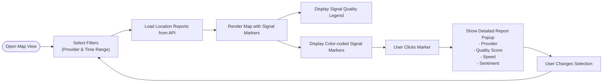
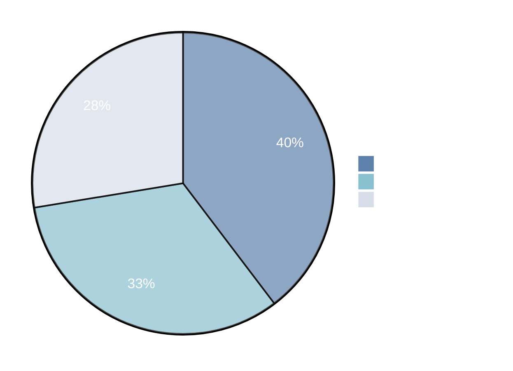
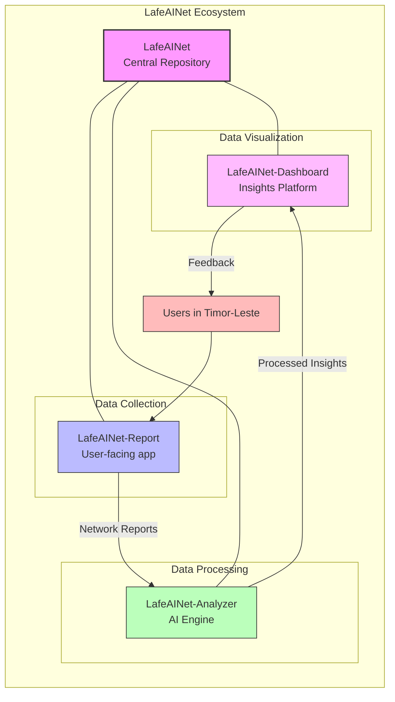

# 🌏 LafeAINet-Dashboard

<div align="center">
  
  
  
  
  
  <br>
  <strong>🏆 Submission for AI for Connectivity Hackathon II: Building Resilient Networks</strong>
</div>

<div align="center">
  <h3>Interactive network quality visualization dashboard for Timor-Leste</h3>
  <h4>Transforming network data into actionable telecommunications insights</h4>
  <p><a href="https://lafeainet-dashboard.vercel.app" target="_blank">View Live Demo →</a></p>
</div>

## 🌟 About LafeAINet-Dashboard

LafeAINet-Dashboard is a comprehensive visualization platform that transforms network quality data collected across Timor-Leste into actionable insights.

### 💡 Why It Matters

In Timor-Leste, reliable telecommunications infrastructure is crucial for:

- **Economic Development**: Enabling digital businesses and remote work
- **Education Access**: Supporting distance learning and online resources
- **Healthcare Services**: Facilitating telemedicine in remote areas
- **Emergency Response**: Improving coordination during natural disasters

Our dashboard helps identify where and how telecommunications infrastructure needs improvement to support these critical needs.

## 🚀 Key Features

<table>
  <tr>
    <td width="50%" valign="top">
      <h3>📊 Network Quality Statistics</h3>
      <p>Real-time analytics on connectivity metrics with trend indicators</p>
    </td>
    <td width="50%" valign="top">
      <h3>🔍 Provider Performance Matrix</h3>
      <p>Detailed comparison across telecommunications providers</p>
    </td>
  </tr>
  <tr>
    <td width="50%" valign="top">
      <h3>📈 Historical Trend Analysis</h3>
      <p>Track network improvements over time with interactive charts</p>
    </td>
    <td width="50%" valign="top">
      <h3>🗺️ Interactive Coverage Map</h3>
      <p>Geospatial visualization of network quality data</p>
    </td>
  </tr>
  <tr>
    <td width="50%" valign="top">
      <h3>📱 Responsive Design</h3>
      <p>Optimized for both desktop and mobile devices</p>
    </td>
    <td width="50%" valign="top">
      <h3>⏱️ Time-Based Filtering</h3>
      <p>Analyze data across different timeframes (24h, 7d, 30d, 90d)</p>
    </td>
  </tr>
</table>

## 📊 System Architecture

```mermaid
flowchart TD
    subgraph "Client Layer"
        UI["User Interface (React 19)"]
        Navigation["Navigation Component"]

        subgraph "Dashboard Pages"
            StatsPage["Network Statistics Page"]
            MapPage["Coverage Map Page"]
        end

        subgraph "Dashboard Components"
            ProviderCards["Provider Cards"]
            ProgressBars["Progress Bar Visualizations"]
            SummaryCards["Summary Cards"]
            TrendIndicators["Trend Indicators"]
            TimeRangeFilter["Time Range Filter"]

            subgraph "Charts & Visualizations"
                DoughnutCharts["Doughnut Charts\nQuality & Speed Distribution"]
                LineCharts["Historical Performance Trend Charts"]
                MapComponent["Interactive Map Component\n(Leaflet)"]
            end

            ProviderModal["Provider Detail Modal"]
        end
    end
    subgraph "Next.js Application (LafeAINet-Dashboard)"
        ClientComp["Client Components"]
        ServerComp["Server Components"]
        APIRoutes["API Routes"]
    end

    subgraph "API Layer"
        StatsAPI["GET /api/stats\n(Network Statistics)"]
        LocationAPI["GET /api/location-reports\n(Map Data)"]
    end
    subgraph "External Dependencies"
        ChartJS["Chart.js Library"]
        Leaflet["Leaflet Maps Library"]
        Tremor["Tremor UI Components"]
        OpenStreetMap["OpenStreetMap Tiles"]
    end

    subgraph "Database Layer (TiDB)"
        DB[(TiDB Database)]
        subgraph "Tables"
            NetworkReports[("network_reports")]
            Providers[("providers")]
            AnalysisResults[("analysis_results")]
        end
    end

    subgraph "Integration Points"
        ReportApp["LafeAINet-Report App\n(Data Collection)"]
        AnalyzerApp["LafeAINet-Analyzer App\n(AI Processing)"]
    end
    %% Connections - UI flow
    UI --> Navigation
    Navigation --> StatsPage
    Navigation --> MapPage
    Navigation --> ReportApp

    %% Dashboard components connections
    StatsPage --> ProviderCards
    StatsPage --> SummaryCards
    StatsPage --> DoughnutCharts
    StatsPage --> LineCharts
    StatsPage --> TimeRangeFilter
    StatsPage --> TrendIndicators
    ProviderCards --> ProgressBars
    ProviderCards --> ProviderModal
    MapPage --> MapComponent
    MapPage --> TimeRangeFilter

    %% API and data connections
    StatsPage --> StatsAPI
    MapPage --> LocationAPI

    StatsAPI --> ServerComp
    LocationAPI --> ServerComp
    ServerComp --> DB

    %% External libraries
    DoughnutCharts --> ChartJS
    LineCharts --> ChartJS
    MapComponent --> Leaflet
    Leaflet --> OpenStreetMap
    SummaryCards --> Tremor
    ProviderCards --> Tremor

    %% Database relationships
    DB --> NetworkReports
    DB --> Providers
    DB --> AnalysisResults

    %% Integration flows
    ReportApp -- "Submit Reports" --> NetworkReports
    AnalyzerApp -- "Update Scores" --> NetworkReports
    AnalyzerApp -- "Store Analysis" --> AnalysisResults

    %% Legend/styling
    classDef clientLayer fill:#f9e0ff,stroke:#333,stroke-width:1px
    classDef apiLayer fill:#d6eaff,stroke:#333,stroke-width:1px
    classDef external fill:#ffe9d6,stroke:#333,stroke-width:1px
    classDef database fill:#dbffd6,stroke:#333,stroke-width:1px
    classDef integration fill:#e6e6ff,stroke:#333,stroke-width:1px

    class UI,Navigation,StatsPage,MapPage,ProviderCards,ProgressBars,SummaryCards,TrendIndicators,TimeRangeFilter,DoughnutCharts,LineCharts,MapComponent,ProviderModal clientLayer
    class StatsAPI,LocationAPI,APIRoutes,ClientComp,ServerComp apiLayer
    class ChartJS,Leaflet,Tremor,OpenStreetMap external
    class DB,NetworkReports,Providers,AnalysisResults database
    class ReportApp,AnalyzerApp integration
```



## 🖥️ Dashboard Views

### Network Statistics Dashboard

The main dashboard provides a comprehensive overview of network performance:

- **Summary Statistics**: Key metrics with trend indicators
- **Provider Distribution**: Interactive doughnut charts showing quality and speed distribution
- **Historical Performance**: Multi-axis line chart tracking quality, speed, and sentiment over time
- **Provider Performance Matrix**: Interactive cards for detailed provider comparison

### Interactive Coverage Map

The map view offers geographic insights into network quality:



## 🛠️ Technology Stack

<table align="center">
  <tr>
    <td align="center"><strong>Frontend</strong></td>
    <td align="center"><strong>Visualization</strong></td>
    <td align="center"><strong>Backend</strong></td>
  </tr>
  <tr>
    <td>
      • React 19<br>
      • Next.js 15<br>
      • Tremor UI
    </td>
    <td>
      • Chart.js 4.0<br>
      • Leaflet 1.9<br>
      • Lucide Icons
    </td>
    <td>
      • Next.js API Routes<br>
      • MySQL2 Client<br>
      • TiDB Database
    </td>
  </tr>
</table>

## 📊 Data Visualization Examples

### Provider Performance Matrix

The dashboard compares network providers across key metrics:



## 🔧 Installation and Setup

### Prerequisites

- Node.js 20 or higher
- npm or yarn
- MySQL-compatible database (TiDB recommended)

### Quick Start

1. **Clone the repository**

```bash
git clone https://github.com/ajitonelsonn/lafeainet-dashboard.git
cd lafeainet-dashboard
```

2. **Install dependencies**

```bash
npm install
# or
yarn install
```

3. **Configure environment variables**

Create a `.env.local` file with:

```
DB_HOST=your-database-host
DB_USER=your-database-user
DB_PASSWORD=your-database-password
DB_NAME=db_netrep_tls
DB_PORT=4000
```

4. **Run the development server**

```bash
npm run dev
# or
yarn dev
```

5. **Open your browser**

Navigate to [http://localhost:3000](http://localhost:3000) to see the dashboard.

## 🌱 The LafeAINet Ecosystem



LafeAINet-Dashboard is part of a larger initiative to improve connectivity in Timor-Leste:

- **[LafeAINet](https://github.com/ajitonelsonn/LafeAINet)**: Main repository for the complete ecosystem
- **[LafeAINet-Report](https://github.com/ajitonelsonn/lafeainet-report)**: User-facing app for collecting network reports
- **[LafeAINet-Analyzer](https://github.com/ajitonelsonn/lafeainet-analyzer)**: AI engine for processing network data
- **[LafeAINet-Dashboard](https://github.com/ajitonelsonn/lafeainet-dashboard)**: Visualization platform for network insights (this repo)

## 💡 Real-World Impact

<table>
  <tr>
    <td width="33%" align="center">
      <h3>🎯 Targeted Investments</h3>
      <p>Helps telecom companies direct resources to areas most in need</p>
    </td>
    <td width="33%" align="center">
      <h3>📊 Performance Monitoring</h3>
      <p>Allows regulators to track service quality improvements</p>
    </td>
    <td width="33%" align="center">
      <h3>🔍 Gap Identification</h3>
      <p>Highlights underserved areas requiring urgent attention</p>
    </td>
  </tr>
</table>

## 👥 Contributors

<table>
  <tr>
    <td align="center">
      <a href="https://github.com/ajitonelsonn">
        
        <br />
        <sub><b>Ajito Nelson</b></sub>
      </a>
    </td>
    <!-- Add more contributors as needed -->
  </tr>
</table>

## 📜 License

This project is licensed under the [MIT License](LICENSE).

---

<div align="center">
  <p>Built with 💙 for improving connectivity in Timor-Leste</p>
  <p>
    <a href="https://lablab.ai/event/ai-for-connectivity-hackathon-building-resilient-networks">AI for Connectivity Hackathon II</a>
    •
    <a href="https://github.com/ajitonelsonn/LafeAINet">LafeAINet Ecosystem</a>
    •
    <a href="https://lafeainet-dashboard.vercel.app">Live Demo</a>
  </p>
</div>
